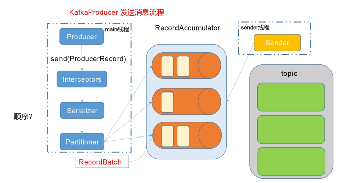

## Producer API


### 一、消息发送流程

Kafka 的 Producer 客户端就是完成将消息发送到 Kafka 服务器。完成这个功能只需要使用 KafkaProducer 的```send()``` 方法即可。其内部原理是由两个线程共同完成，**主线程和 Sender 线程**，Sender 线程是主线程的守护线程。主线程负责创建消息对象，并将消息放在缓存 (RecordAccumulator) 中，Sender 线程从缓存取出消息然后进行网络发送。

流程描述

> a. producer 先从 zookeeper 的 "/brokers/.../state" 节点找到该 partition 的 leader
> b. producer 将消息发送给该leader
> c. leader 将消息写入到本地的 log
> d. follower 从 leader 拉取消息，写入本地的 log 后向 leader 发送 ack
> e. leader收到 ISR 中的 replica 的ack后，增加 HW（high watermark，最后commit的offset）并向 producer 发送 ACK。

**producer 在通过网络发送给 leader 之前的流程大致的流程图如下：**



#### 主线程：

1、封装消息对象，ProducerRecord，然后调用 send方法

2、然后进入 producer 拦截器

3、更新 KafkaCluster 数据

4、序列化，将消息对象序列化成 byte 数组

5、分区器计算分区

6、将消息追加到缓存 RecordAccumulator。

> 关于 RecordAccumulator 的简要说明：追加到 RecordAccumulator 时候会对消息进行分类，发往同一分区的消息会被装在同一个Deque (双端队列) 中，Deque 存放一批 ProducerBatch 表示一组消息。
>
> 也就是 RecordAccumulator 会按照分区进行队列维护。队列中存放的是发往该分区的消息组，追加消息时候从队列的尾部追加，RecordAccumulator 的大小默认32M，可以通过 buffer.memory 进行配置指定，如果内存空间用完了，追加消息将发生阻塞直到有空间可用为止，默认最大阻塞 60s（超时会报错）,可以通过数 max.block.ms 配置。

#### sender 线程：

a.当 RecordAccumulator 中攒够一批数据后，即达到指定量的数据之后，Sender 线程将这一批数据拉取并发送给 Topic。控制参数：**batch.size **=> 只有数据积累到batch.size之后，sender才会发送数据。

b.同时，如果 RecordAccumulator 中队列迟迟到不到指定量的数据时，会等到一定时长时发送。控制参数：**linger.ms** => 如果数据迟迟未达到 batch.size , sender 等待 linger.time 之后就会发送数据

1、sender 线程将消息从 RecordAccumulator 中取出处理消息格式。

2、构建发送的请求对象 Request

3、将请求交给 Selector,并将请求存放在请求队列。

4、收到响应就移除请求队列的请求，调用每个消息上的回调函数。

注意：InFlightRequests 就是请求队列，内部为了发往每个 broker 的请求的 Deque , Deque 中存放的是未响应请求，其中最大值默认 5，可以通过 max.in.flight.requests.per.connection 进行配置。这只是简要流程，尤其是sender 发送消息的网络层，流程是非常复杂的。

----------

### 二、API 使用

#### 异步发送API

**1）导入依赖**

```xml
<dependencies>
	<dependency>
		<groupId>org.apache.kafka</groupId>
		<artifactId>kafka-clients</artifactId>
		<version>2.4.1</version>
	</dependency>
</dependencies>
```

**2）编写代码** 

需要用到的类： 

**KafkaProducer**：需要创建一个生产者对象，用来发送数据 

**ProducerConfig**：获取所需的一系列配置参数 

**ProducerRecord**：每条数据都要封装成一个 ProducerRecord 对象

```java
public class CustomProducer {
    public static void main(String[] args) throws InterruptedException {
        // 1. 创建kafka生产者的配置对象
        Properties properties = new Properties();
        // 2. 给kafka配置对象添加配置信息
        properties.put("bootstrap.servers","node1:9092");
        // 设置ack
        properties.put("acks", "all");
        // 重试次数
        properties.put("retries", 1);
        // 批次大小 默认16K
        properties.put("batch.size", 16384);
        // 等待时间
        properties.put("linger.ms", 1);
        // RecordAccumulator 缓冲区大小 默认32M
        properties.put("buffer.memory", 33554432);
        // key,value序列化
        properties.put("key.serializer",
                       "org.apache.kafka.common.serialization.StringSerializer");
        properties.put("value.serializer",
                       "org.apache.kafka.common.serialization.StringSerializer");
        // 3. 创建kafka生产者对象
        KafkaProducer<String, String> kafkaProducer = 
            new KafkaProducer<String, String>(properties);
        // 4. 调用send方法,发送消息
        for (int i = 0; i < 10; i++) {
            kafkaProducer.send(new ProducerRecord<>("first","kafka" + i));
        }
        // 5. 关闭资源
        kafkaProducer.close();
    }
} 
```
**使用回调函数的 send 方法：**回调函数会在 producer 收到 ack 时调用，为异步调用，该方法有两个参数，分别是RecordMetadata 和 Exception，如果 Exception 为 null，说明消息发送成功，如果 Exception 不为 null，说明消息发送失败。

注意：消息发送失败会自动重试，不需要我们在回调函数中手动重试。

```java
// 添加回调
kafkaProducer.send(new ProducerRecord<>("first", "kafka" + i), new Callback() {
	// 该方法在Producer收到ack时调用，为异步调用
	@Override
	public void onCompletion(RecordMetadata metadata, Exception exception) {
		if (exception == null) {
			// 没有异常,输出信息到控制台
			System.out.println("success->" + metadata.offset());
		} else {
			// 出现异常打印
			exception.printStackTrace();
			}
		}
);
```

#### 同步发送API

同步发送的意思就是，一条消息发送之后，会阻塞当前线程，直至返回ack。由于 send 方法返回的是一个 Future对象，根据 Futrue 对象的特点，我们也可以实现同步发送的效果，只需在调用 Future 对象的 get 方发即可。

```java
kafkaProducer.send(new ProducerRecord<>("first","kafka" + i)).get();
```

#### 自定义分区器

1） 默认的分区器 DefaultPartitioner

2）自定义分区器

```java
/**
 * 1. 实现接口Partitioner
 * 2. 实现3个方法:partition,close,configure
 * 3. 编写partition方法,返回分区号
 */
public class MyPartitioner implements Partitioner {
    /**
     * 返回信息对应的分区
     * @param topic         主题
     * @param key           消息的key
     * @param keyBytes      消息的key序列化后的字节数组
     * @param value         消息的value
     * @param valueBytes    消息的value序列化后的字节数组
     * @param cluster       集群元数据可以查看分区信息
     * @return
     */
    @Override
    public int partition(String topic, Object key, byte[] keyBytes,
    Object value, byte[] valueBytes, Cluster cluster) {
        // 获取消息
        String msgValue = value.toString();
        // 创建partition
        int partition;
        // 判断消息是否包含atguigu
        if (msgValue.contains("nuomuo")){
            partition = 0;
        }else {
            partition = 1;
        }
        // 返回分区号
        return partition;
    }
    @Override
    public void close() {

    }
    @Override
    public void configure(Map<String, ?> configs) {

    }
}
```

--------

#### 自定义拦截器

##### 拦截器原理

Producer 拦截器(interceptor)是在Kafka 0.10 版本被引入的，主要用于实现 clients 端的定制化控制逻辑。

对于 producer 而言，interceptor 使得用户在消息发送前以及 producer 回调逻辑前有机会对消息做一些定制化需求，比如修改消息等。同时，producer 允许用户指定多个 interceptor 按序作用于同一条消息从而形成一个拦截链(interceptor chain)。Intercetpor 的实现接口是 **org.apache.kafka.clients.producer.ProducerInterceptor**，其定义的方法包括：

（1）configure(configs)

获取配置信息和初始化数据时调用。

（2）onSend(ProducerRecord)：

该方法封装进 KafkaProducer.send 方法中，即它运行在用户主线程中。Producer 确保在消息被序列化以及计算分区前调用该方法。用户可以在该方法中对消息做任何操作，但最好保证不要修改消息所属的 topic 和分区，否则会影响目标分区的计算。

（3）onAcknowledgement(RecordMetadata, Exception)：

该方法会在消息从 RecordAccumulator 成功发送到 Kafka Broker 之后，或者在发送过程中失败时调用。并且通常都是在 producer 回调逻辑触发之前(**new Callback().onCompletion()之前**)。onAcknowledgement 运行在 producer 的 IO 线程中，因此不要在该方法中放入很重的逻辑，否则会拖慢 producer 的消息发送效率。

（4）close：

关闭 interceptor，主要用于执行一些资源清理工作

如前所述，interceptor 可能被运行在多个线程中，因此在具体实现时用户需要自行确保线程安全。另外倘若指定了多个 interceptor，则 producer 将按照指定顺序调用它们，并仅仅是捕获每个 interceptor 可能抛出的异常记录到错误日志中而非在向上传递。这在使用过程中要特别留意。

##### 拦截器案例

1）需求：

实现一个简单的双 interceptor 组成的拦截链。第一个 interceptor 会在消息发送前将时间戳信息加到消息 value的最前部；第二个 interceptor 会在消息发送后更新成功发送消息数或失败发送消息数。

拦截器1：

```java
public class MyInterceptor implements ProducerInterceptor<String, String> {
    @Override
    public ProducerRecord<String, String> onSend(ProducerRecord<String, String> record) {
        String value = System.currentTimeMillis() + record.value().toString();
        // 返回一个新的消息,保留原有的主题分区,修改消息value
        return new ProducerRecord<String,String>
            (record.topic(), record.partition(),record.timestamp(), record.key(), value);
    }
    @Override
    public void onAcknowledgement(RecordMetadata recordMetadata, Exception e) {
    }
    @Override
    public void close() {   
    }
    @Override
    public void configure(Map<String, ?> map) {
    }
}
```

拦截器2：

```java
public class MyInterceptor implements ProducerInterceptor<String, String> {
    // 声明属性 成功次数和失败次数
    private Integer success = 0;
    private Integer failed = 0;
    @Override
    public ProducerRecord<String, String> onSend(ProducerRecord<String, String> record) {
        return record
    }
    @Override
    public void onAcknowledgement(RecordMetadata recordMetadata,Exception e) {
        if (e == null){
            success++;
        }else{
            failed++;
        }
    }
    @Override
    public void close() {
        // 将成功次数和失败次数打印到控制台
        System.out.println("成功次数" + success);
        System.out.println("失败次数" + failed);
    }
    @Override
    public void configure(Map<String, ?> map) {
    }
}
```

主方法：

```java
public class InterceptorProducer {
    public static void main(String[] args) throws InterruptedException, ExecutionException {
        
		... 
		
        // 添加拦截器配置
        ArrayList<String> interceptors = new ArrayList<>();
        interceptors.add("com.nuomuo.MyInterceptor1");
        interceptors.add("com.nuomuo.MyInterceptor2");
        properties.put(ProducerConfig.INTERCEPTOR_CLASSES_CONFIG, interceptors);

        // 创建kafka生产者对象
        KafkaProducer<String, String> kafkaProducer = 
        new KafkaProducer<String, String>(properties);
        for (int i = 0; i < 10; i++) {
            // 异步发送 默认
            //kafkaProducer.send(new ProducerRecord<>("first","kafka" + i));
            // 同步发送
            kafkaProducer.send(new ProducerRecord<>("first", "kafka" + i)).get();
        }
        Thread.sleep(5000);
        // 关闭资源
        kafkaProducer.close();
    }
}
```


