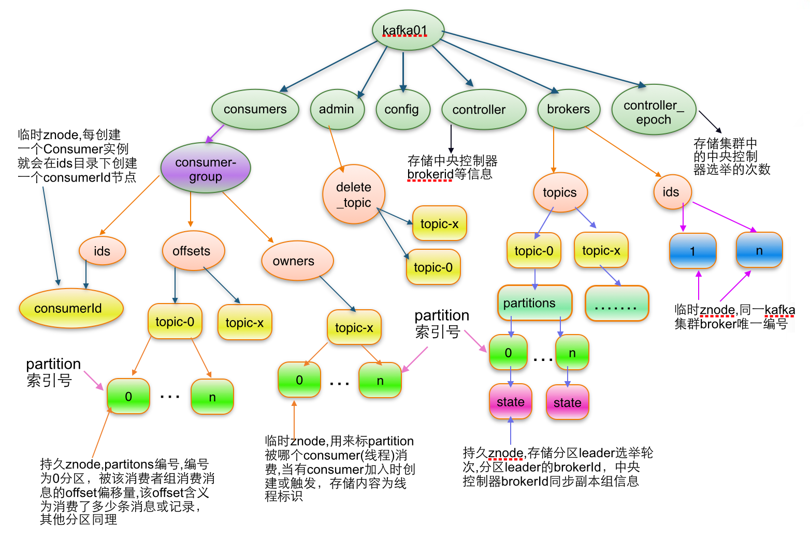

> 1、记录Broker、消费者组的信息（注意不记录生产者信息）2、Kafka集群中有一个broker会被选举为Controller，负责管理集群 broker 的上下线。3、所有 topic 的分区副本分配和 leader 选举等工作。


Kafka 集群中有一个 broker 会被选举为 Controller，负责管理集群 broker 的上下线，Controller 的管理工作都是依赖于Zookeeper的。

所有 topic 的分区副本分配和 leader 选举等工作。





### 1、Broker 注册

**Broker 是分布式部署并且相互之间相互独立，但是需要有一个注册系统能够将整个集群中的Broker管理起来**，此时就使用到了Zookeeper。在Zookeeper上会有一个专门**用来进行 Broker 服务器列表记录**的节点：

```/brokers/ids```

每个Broker在启动时，都会到Zookeeper上进行注册，即到/brokers/ids下创建属于自己的节点，如/brokers/ids/[0...N]。

Kafka 使用了全局唯一的数字来指代每个 Broker 服务器，不同的 Broker 必须使用不同的 Broker ID 进行注册，创建完节点后，**每个Broker 就会将自己的 IP 地址和端口信息记录**到该节点中去。其中，Broker 创建的节点类型是临时节点，一旦 **Broker** 宕机，则对应的临时节点也会被自动删除。


#### 生产者的负载均衡

由于同一个 Topic 消息会被分区并将其分布在多个 Broker 上，因此，**生产者需要将消息合理地发送到这些分布式的 Broker 上**，那么如何实现生产者的负载均衡，Kafka 支持传统的四层负载均衡，也支持 Zookeeper 方式实现负载均衡。

(1) 四层负载均衡，根据生产者的 IP 地址和端口来为其确定一个相关联的 Broker。通常，一个生产者只会对应单个Broker，然后该生产者产生的消息都发往该 Broker。这种方式逻辑简单，每个生产者不需要同其他系统建立额外的 TCP 连接，只需要和 Broker 维护单个 TCP 连接即可。但是，其无法做到真正的负载均衡，因为实际系统中的每个生产者产生的消息量及每个 Broker 的消息存储量都是不一样的，如果有些生产者产生的消息远多于其他生产者的话，那么会导致不同的 Broker 接收到的消息总数差异巨大，同时，生产者也无法实时感知到 Broker 的新增和删除。

(2) 使用Zookeeper进行负载均衡，由于每个 Broker 启动时，都会完成 Broker 注册过程，生产者会通过该节点的变化来动态地感知到 Broker 服务器列表的变更，这样就可以实现动态的负载均衡机制。


### 2、Topic 注册信息

在 Kafka 中，同一个 **Topic 的消息会被分成多个分区**并将其分布在多个 Broker 上，**这些分区信息及与 Broker的对应关系**也都是由Zookeeper在维护，由专门的节点来记录，如：

```/borkers/topics/[topicname]```


### 3、partition 状态信息

Kafka 中 每个Topic 都会以 /brokers/topics/[topic] 的形式被记录。Broker服务器启动后，会到对应 Topic 节点（/brokers/topics）上注册自己的 Broker ID 并写入针对该 Topic 的分区总数，如 /brokers/topics/login/3->2，这个节点表示 Broker ID 为 3 的一个 Broker 服务器，对于 "login" 这个Topic的消息，提供了 2 个分区进行消息存储，同样，这个分区节点也是临时节点。

/brokers/topics/[topic]/partitions/[0...N]  其中[0..N]表示partition索引号

/brokers/topics/[topic]/partitions/[partitionId]/state

```
Schema:
{"controller_epoch": 表示kafka集群中的中央控制器选举次数,"leader": 表示该partition选举leader的brokerId,"version": 版本编号默认为1,
"leader_epoch": 该partition leader选举次数,"isr": [同步副本组brokerId列表]}
Example:
{"controller_epoch":61,"leader":0,"version":1,"leader_epoch":0,"isr":[0,2,1]}
```


### 4、消费者注册

消费者服务器在初始化启动时加入消费者分组的步骤如下

注册到消费者分组。每个消费者服务器启动时，都会到Zookeeper的指定节点下创建一个属于自己的消费者节点，例如/consumers/[group_id]/ids/[consumer_id]，完成节点创建后，消费者就会将自己订阅的Topic信息写入该临时节点。

**对 消费者分组 中的 消费者 的变化注册监听**。每个 消费者 都需要关注所属 消费者分组 中其他消费者服务器的变化情况，即对/consumers/[group_id]/ids节点注册子节点变化的Watcher监听，一旦发现消费者新增或减少，就触发消费者的负载均衡。

**对Broker服务器变化注册监听**。消费者需要对/broker/ids/[0-N]中的节点进行监听，如果发现Broker服务器列表发生变化，那么就根据具体情况来决定是否需要进行消费者负载均衡。

**进行消费者负载均衡**。为了让同一个Topic下不同分区的消息尽量均衡地被多个 消费者 消费而进行 消费者 与 消息 分区分配的过程，通常，对于一个消费者分组，如果组内的消费者服务器发生变更或Broker服务器发生变更，会发出消费者负载均衡。

#### 消费者负载均衡

与生产者类似，Kafka 中的消费者同样需要进行负载均衡来实现多个消费者合理地从对应的 Broker 服务器上接收消息，每个消费者分组包含若干消费者，**每条消息都只会发送给分组中的一个消费者**，不同的消费者分组消费自己特定的 Topic 下面的消息，互不干扰。


a.每个consumer客户端被创建时,会向zookeeper注册自己的信息;
b.此作用主要是为了"负载均衡".
c.同一个Consumer Group中的Consumers，Kafka将相应Topic中的每个消息只发送给其中一个Consumer。
d.Consumer Group中的每个Consumer读取Topic的一个或多个Partitions，并且是唯一的Consumer；
e.一个Consumer group的多个consumer的所有线程依次有序地消费一个topic的所有partitions,如果Consumer group中所有consumer总线程大于partitions数量，则会出现空闲情况;

**举例说明：**

kafka集群中创建一个topic为report-log  4 partitions 索引编号为0,1,2,3，假如有目前有三个消费者node：注意-->一个consumer中一个消费线程可以消费一个或多个partition.如果每个consumer创建一个consumer thread线程,各个node消费情况如下，node1消费索引编号为0,1分区，node2费索引编号为2,node3费索引编号为3，如果每个consumer创建2个consumer thread线程，各个node消费情况如下(是从consumer node先后启动状态来确定的)，node1消费索引编号为0,1分区；node2费索引编号为2,3；node3为空闲状态。

#### Consumer 均衡算法

当一个group中,有consumer加入或者离开时,会触发partitions均衡.均衡的最终目的,是提升topic的并发消费能力.
1) 假如topic1,具有如下partitions: P0,P1,P2,P3
2) 加入group中,有如下consumer: C0,C1
3) 首先根据partition索引号对partitions排序: P0,P1,P2,P3
4) 根据(consumer.id + '-'+ thread序号)排序: C0,C1
5) 计算倍数: M = [P0,P1,P2,P3].size / [C0,C1].size,本例值M=2(向上取整)
6) 然后依次分配partitions: C0 = [P0,P1],C1=[P2,P3],即Ci = [P(i * M),P((i + 1) * M -1)]


### 

### 5、分区与消费者 的关系 Consumer owner

consumer group 下有多个 Consumer（消费者）。对于每个消费者组 (Consumer Group)，Kafka 都会为其分配一个全局唯一的 Group ID，Group 内部的所有消费者共享该 ID。订阅的 topic 下的每个分区只能分配给某个 group 下的一个 consumer (当然该分区还可以被分配给其他group)。
同时，Kafka为每个消费者分配一个Consumer ID，通常采用"Hostname:UUID"形式表示。

在 Kafka 中，规定了**每个消息分区 只能被同组的一个消费者进行消费**，因此，需要在 Zookeeper 上记录消息分区 与 Consumer 之间的关系，每个消费者一旦确定了对一个消息分区的消费权力，需要将其 Consumer ID 写入到 Zookeeper 对应消息分区的临时节点上，例如：

/consumers/[group_id]/owners/[topic]/[broker_id-partition_id]

其中，[broker_id-partition_id] 就是一个 消息分区 的标识，节点内容就是该 消息分区上消费者的 Consumer ID。


/consumers/[groupId]/owners/[topic]/[partitionId] -> consumerIdString + threadId索引编号

a) 首先进行"Consumer Id注册";

b) 然后在"Consumer id 注册"节点下注册一个watch用来监听当前group中其他consumer的"退出"和"加入";只要此znode path下节点列表变更,都会触发此group下consumer的负载均衡.(比如一个consumer失效,那么其他consumer接管partitions).

c) 在"Broker id 注册"节点下,注册一个watch用来监听broker的存活情况;如果broker列表变更,将会触发所有的groups下的consumer重新balance.


### 6、Controller注册信息

/controller -> int (broker id of the controller)  存储center controller中央控制器所在kafka broker的信息

```
Schema:
{"version": 版本编号默认为1,"brokerid": kafka集群中broker唯一编号,"timestamp": kafka broker中央控制器变更时的时间戳}
Example:
{"version": 1,"brokerid": 0,"timestamp": "1533452008692"}
```


### 7、Controller epoch

/controller_epoch --> int (epoch)  

此值为一个数字,kafka集群中第一个broker第一次启动时为1，以后只要集群中center controller中央控制器所在broker变更或挂掉，就会重新选举新的center controller，每次center controller变更controller_epoch值就会 + 1; 