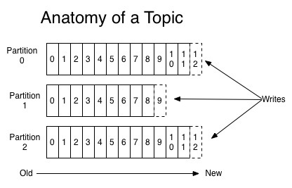
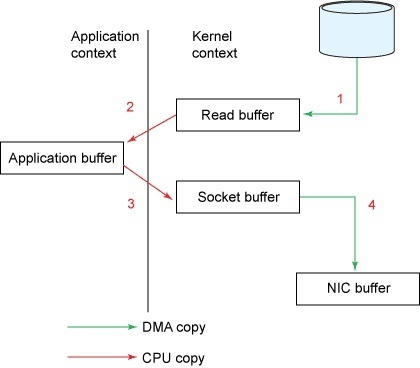
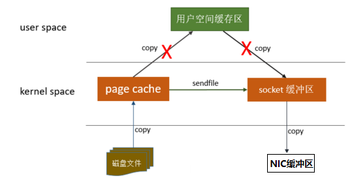
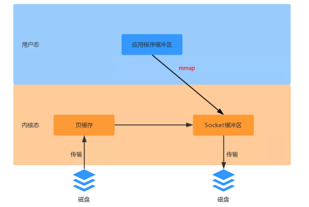
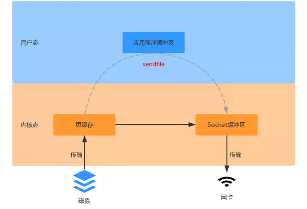
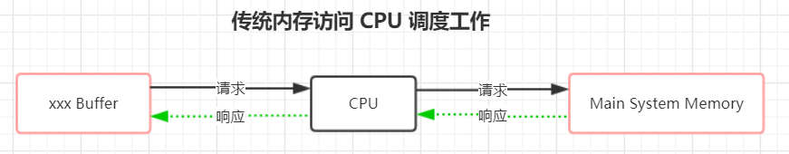
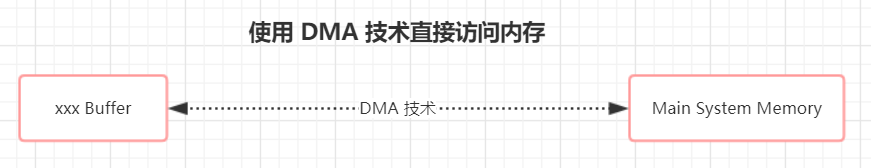

Kafka 除了具备消息队列 MQ 的特性和使用场景外，它还有一个重要用途，就是做存储层。因为 kafka 数据是持久化磁盘的，还速度快；还可靠、支持分布式。

首先要有个概念，kafka 高性能的背后，是多方面协同后、最终的结果，kafka 从宏观架构、分布式 partition 存储、ISR 数据同步、以及 “无孔不入” 的高效利用磁盘/操作系统特性，这些多方面的协同，是 kafka 成为性能之王的必然结果。

<!--more-->

### 为什么 Kafka 读写这么快

kafka 作为 MQ 也好，作为存储层也好，无非是两个重要功能，一是 Producer 生产的数据存到 broker，二是 Consumer 从 broker 读取数据；我们把它简化成如下两个过程：
1、网络数据持久化到磁盘
2、磁盘文件通过网络发送

#### 1、顺序读写磁盘

Kafka 是将消息持久化到本地磁盘中的，一般人会认为磁盘读写性能差，可能会对 Kafka 性能提出质疑。实际上不管是内存还是磁盘，快或慢的关键在于寻址方式，磁盘分为顺序读写与随机读写，内存一样也分为顺序读写与随机读写。基于磁盘的随机读写确实很慢，但基于磁盘的顺序读写性能却很高，一般而言要高出磁盘的随机读写三个数量级，一些情况下磁盘顺序读写性能甚至要高于内存随机读写。

**kafka 将来自 Producer 的数据，顺序追加在  partition，partition 就是一个文件，以此实现顺序写入。同时Consumer从 broker 读取数据时，因为自带了偏移量，接着上次读取的位置继续读，以此实现顺序读。**顺序读写，是 kafka 利用磁盘特性的一个重要体现。



#### 2、分区分段技术--->日志索引

Kafka 的 message 是按 topic 分类存储的，topic 中的数据又是按照一个一个的 partition 即分区存储到不同broker 节点。每个 partition 对应了操作系统上的一个文件夹，partition 实际上又是按照 segment 分段存储的。这也非常符合分布式系统分区分桶的设计思想。

通过这种分区分段的设计，Kafka 的 message 消息实际上是分布式存储在一个一个小的 segment 中的，每次文件操作也是直接操作的 segment。为了进一步的查询优化，Kafka 又默认为分段后的数据文件建立了索引文件，就是文件系统上的 .index 文件。这种分区分段+索引的设计，不仅提升了数据读取的效率，同时也提高了数据操作的并行度。

#### 3、页缓存PageCache

为了优化读写性能，Kafka 利用了操作系统本身的 PageCache，就是利用操作系统自身的内存而不是 JVM 空间内存。另外操作系统本身对 PageCache 做了大量优化，通过操作系统的 PageCache，Kafka 的读写操作基本上是基于系统内存的，读写性能也得到了极大的提升。

Kafka 数据持久化是直接持久化到 Pagecache 中，这样会产生以下几个好处： 

-  I/O Scheduler 会将连续的小块写组装成大块的物理写从而提高性能 

-  系统的I/O Scheduler 会尝试将一些写磁盘的操作重新按顺序排好，从而减少磁盘头的移动时间

-  充分利用所有空闲内存（非 JVM 内存）。JVM 中一切皆对象，对象的存储会带来额外的内存消耗；使用 JVM 会受到 GC 的影响，随着数据的增多，垃圾回收也会变得复杂与缓慢，降低吞吐量；如果使用应用层 Cache（即 JVM 堆内存），会增加 GC 负担。

-  读操作可直接在 PageCache 内进行。如果消费和生产速度相当，甚至不需要通过物理磁盘（直接通过 PageCache）交换数据

-  如果进程重启，JVM 内的 Cache 会失效，但 PageCache 仍然可用。

> 问题: 尽管持久化到 Pagecache上可能会造成宕机丢失数据的情况（因为会有一部分没有写入磁盘的数据在宕机的瞬间存储在页缓存中）。Kafka提供了同步刷盘和间接刷盘的操作，同步刷盘可以防止机器断电等异常造成处于页缓存而没有及时写入磁盘的消息丢失，但是如果为了保证这种情况下数据不丢失而强制将 PageCache 中的数据 Flush 到磁盘，反而会降低性能。这个问题可以被 Kafka 的 Replication（副本）机制解决。


> 调优点：Linux 系统会使用磁盘的一部分作为 swap 分区，这样可以进行进程的调度：把当前非活跃的进程调入 swap 分区，以此把内存空出来让给活跃的进程。对大量使用系统页缓存的 Kafka 而言，应当避免这种内存的交换，否则会对它的性能产生很大的负面影响。


#### 4、零拷贝

##### 聊聊传统 IO 流程

比如：读取文件，再用socket发送出去
传统方式实现：
先读取、再发送，实际经过 1~4 四次 copy。

```text
buffer = File.read 
Socket.send(buffer)
```

1、将磁盘文件读取到操作系统内核缓冲区即内核模式下的 Read Buffer中；
2、将内核缓冲区的数据复制到 application 应用程序的 buffer即用户模式下；
3、将 application 应用程序 buffer 中的数据复制到 socket 网络发送缓冲区(操作系统内核的缓冲区，内核模式下的 Socket Buffer中)；
4、将 socket buffer 的数据复制到网卡，由网卡进行网络传输。



传统方式下，读取磁盘文件并进行网络发送，经过的四次数据 copy 是非常繁琐的，数据平白无故地从内核模式到用户模式转了一圈，浪费了2次复制过程，并且内核和用户模式的上下文切换也是4次。实际 IO 读写，需要进行 IO 中断，需要 CPU 响应中断(带来上下文切换)，尽管后来引入 DMA 来接管 CPU 的中断请求，但四次 copy 是存在不必要的拷贝的。

重新思考传统 IO 方式，会注意到实际上并不需要第二个和第三个数据副本。应用程序除了缓存数据并将其传输回套接字缓冲区之外什么都不做。相反，数据可以直接从读缓冲区传输到套接字缓冲区。

显然，第二次和第三次数据 copy 其实在这种场景下没有什么帮助反而带来开销，这也正是零拷贝出现的意义。

`这种场景`：是指**读取磁盘文件后，不需要做其他处理，直接用网络发送出去**。试想，如果读取磁盘的数据需要用程序进一步处理的话，必须要经过第二次和第三次数据 copy，让应用程序在内存缓冲区处理。

零拷贝是指 Kafka 利用 linux  操作系统的 "zero-copy" 机制在消费端做的优化。首先来看一下消费端在消费数据时，数据从broker 磁盘通过网络传输到消费端的整个过程：

1、操作系统从磁盘读取数据到内核空间（kernel space）的page cache；
2、应用程序读取page cache的数据到用户空间（user space）的缓冲区；
3、应用程序将用户空间缓冲区的数据写回内核空间的socket缓冲区（socket buffer）；
4、操作系统将数据从socket缓冲区复制到硬件（如网卡）缓冲区；

 

整个过程如上图所示，这个过程包含 4次 copy 操作和 2次 系统上下文切换，而上下文切换是  CPU 密集型的工作，数据拷贝是 I/O 密集型的工作，性能其实非常低效。零拷贝就是使用了一个名为 sendfile() 的系统调用方法，将数据从 page cache 直接发送到 Socket 缓冲区，避免了系统上下文的切换，消除了从内核空间到用户空间的来回复制。从上图可以看出，"零拷贝"并不是说整个过程完全不发生拷贝，而是站在内核的角度来说的，避免了内核空间到用户空间的来回拷贝。


##### MMAP(内存映射文件)（Kafka写数据时用到）

**Memory Mapped Files** 简称 mmap，简单描述其作用就是：将磁盘文件映射到内存, 用户通过修改内存就能修改磁盘文件。此时数据不需要复制到用户态空间。
它的工作原理是直接利用操作系统的 PageCache 来实现文件到物理内存的直接映射。完成映射之后，你对物理内存的操作会被同步到硬盘上（操作系统在适当的时候）。

通过 mmap，进程像读写硬盘一样读写内存（当然是虚拟机内存），也不必关心内存的大小有虚拟内存为我们兜底。使用这种方式可以获取很大的I/O提升，省去了用户空间到内核空间复制的开销。

mmap 也有一个很明显的缺陷——不可靠，写到mmap中的数据并没有被真正的写到硬盘，操作系统会在程序主动调用 flush 的时候才把数据真正的写到硬盘。Kafka 提供了一个参数 ```producer.type``` 来控制是不是主动 flush；如果 Kafka 写入到 mmap 之后就立即 flush 然后再返回 Producer叫同步(sync)；写入 mmap 之后立即返回Producer不调用 flush 叫异步 (async)。



上面的图片我们可以这样去理解，比如我们需要从 src.data 文件复制数据到 dest.data 文件中。此时我们不需要更改 src.data 里面的数据，但是对于 dest.data 需要追加一些数据。此时 src.data 里面的数据可以直接通过 DMA 设备传输，而应用程序还需要对 dest.data 做一些数据追加，此时应用对 dest.data 做 mmap 映射，直接对内核态数据进行修改。

##### Sendfile（Kafka读数据时用到）

对于 sendfile 而言，数据不需要在应用程序做业务处理，仅仅是从一个 DMA 设备传输到另一个 DMA 设备。 此时数据只需要复制到内核态，用户态不需要复制数据，并且也不需要像 mmap 那样对内核态的数据的句柄（文件引用）。如下图所示：



 

从上图我们可以发现（输出设备可以是网卡/磁盘驱动），内核态有 2 份数据缓存 。sendfile 是 Linux 2.1 开始引入的，在 Linux 2.4 又做了一些优化。也就是上图中磁盘页缓存中的数据，不需要复制到 Socket 缓冲区，而只是将数据的位置和长度信息存储到 Socket 缓冲区。实际数据是由 DMA 设备直接发送给对应的协议引擎，从而又减少了一次数据复制。

零拷贝技术，直接从内核空间（DMA的）到内核空间（Socket的)、然后发送网卡。应用的场景非常多，如Tomcat、Nginx、Apache等web服务器返回静态资源等，将数据用网络发送出去，都运用了sendfile。
简单理解 sendfile(in,out)就是，**磁盘文件读取到操作系统内核缓冲区后、直接扔给网卡，发送网络数据。**

##### 总结

1、Producer 生产的数据持久化到 broker，采用mmap文件映射，实现顺序的快速写入；
2、Customer从broker读取数据，采用sendfile，将磁盘文件读到OS内核缓冲区后，直接转到socket buffer进行网络发送。

**mmap 和 sendfile总结:**

1、都是Linux内核提供、实现零拷贝的API；
2、sendfile 是将读到内核空间的数据，转到socket buffer，进行网络发送；
3、mmap将磁盘文件映射到内存，支持读和写，对内存的操作会反映在磁盘文件上。

#### 5、批量读写

Kafka数据读写也是批量的而不是单条的。

除了利用底层的技术外，Kafka还在应用程序层面提供了一些手段来提升性能。最明显的就是使用批次。在向Kafka写入数据时，可以启用批次写入，这样可以避免在网络上频繁传输单个消息带来的延迟和带宽开销。假设网络带宽为10MB/S，一次性传输10MB的消息比传输1KB的消息10000万次显然要快得多。

#### 6、批量压缩

在很多情况下，系统的瓶颈不是CPU或磁盘，而是网络IO，对于需要在广域网上的数据中心之间发送消息的数据流水线尤其如此。进行数据压缩会消耗少量的CPU资源，不过对于kafka而言，网络IO更应该需要考虑。

- 如果每个消息都压缩，但是压缩率相对很低，所以Kafka使用了批量压缩，即将多个消息一起压缩而不是单个消息压缩
- Kafka允许使用递归的消息集合，批量的消息可以通过压缩的形式传输并且在日志中也可以保持压缩格式，直到被消费者解压缩
- Kafka支持多种压缩协议，包括Gzip和Snappy压缩协议

Kafka速度的秘诀在于，它把所有的消息都变成一个批量的文件，并且进行合理的批量压缩，减少网络IO损耗，通过mmap提高I/O速度，写入数据的时候由于单个Partion是末尾添加所以速度最优；读取数据的时候配合sendfile直接暴力输出。

------------

### 零拷贝的 Java 实现

JDK 中的 FileChannel 提供了外部 channel 交互的传输方法。transferTo 方法会将当前 FileChannel 的字节直接传输到 channel 中，transferFrom() 方法可以将可读 channel 的字节直接传输到当前 FileChannel 中。transferTo() 方法底层是基于操作系统的 sendfile 这个系统调用来实现的，map 是对 Channel 做 mmap 映射。

下面我们看一下 Java NIO 中的方法摘要：

```java
// 将当前 FileChannel 的字节传输到给定的可写 channel 中
public abstract long transferTo(long position, long count,  WritableByteChannel target) throws IOException;
// 将一个可读 channel 的字节传输到当前 FileChannel中
public abstract long transferFrom(ReadableByteChannel src, long position, long count) throws IOException;
// 对 Channel 做 mmap 映射
public abstract MappedByteBuffer map(MapMode mode, long position, long size) throws IOException;
```

注： transferTo 和 transferFrom 并不保证一定能使用零拷贝。实际上是否能使用零拷贝与操作系统相关，如果操作系统提供 sendfile 这样的零拷贝系统调用，则这两个方法会通过这样的系统调用充分利用零拷贝的优势，否则并不能通过这两个方法本身实现零拷贝。

------------

### DMA 技术的出现

DMA(Direct Memory Access，直接内存存取) 是所有现代电脑的重要特色，它的出现就是为了解决批量数据的输入/输出问题。它允许不同速度的硬件装置来沟通，而不需要依赖于 CPU 的大量中断负载。否则，CPU 需要从来源把每一片段的资料复制到暂存器，然后把它们再次写回到新的地方。在这个时间中，CPU 对于其他的工作来说就无法使用。

传统的内存访问，所有的请求都会发送到 CPU ，然后再由 CPU 来完成相关调度工作。如下图所示：



当 DMA 技术的出现，数据文件在各个层之间的传输，则可以直接绕过CPU，使得外围设备可以通过DMA控制器直接访问内存。与此同时，CPU可以继续执行程序。如下图：



在现代电脑中，很多硬件都是支持 DMA 技术的，这里面其中就包括我们此处用到的网卡。还有其他硬件也都是支持 DMA 技术的，例如：磁盘、显卡、声卡等其他硬件。