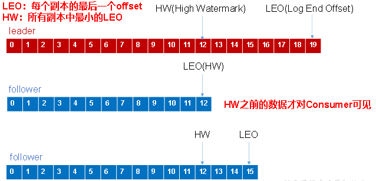

Kafka 最初由 Linkedin 公司开发，是一个分布式的、分区的、多副本的、多订阅者，基于 zookeeper 协调的分布式日志系统（也可以当做 MQ 系统），常用于 web/nginx 日志、访问日志、消息服务等等，Linkedin 于 2010 年贡献给了 Apache 基金会并成为顶级开源项目。

<!--more-->

kafka的特性

> 高吞吐量、低延迟：kafka 每秒可以 处理几十万条消息，它的延迟最低只有几毫秒；
> 可扩展性：kafka 集群支持热扩展；
> 持久性、可靠性：消息被持久化到本地磁盘，并且支持数据备份防止丢失；
> 容错性：允许集群中的节点失败(若副本数量为 n ,则允许 n-1 个节点失败)；
> 高并发：单机可支持数千个客户端同时读写；

kafka的应用场景

- 日志收集：一个公司可以用Kafka收集各种服务的log，通过kafka以统一接口开放给各种消费端，例如hadoop、Hbase、Solr等。
- 消息系统：解耦生产者和消费者、缓存消息等。
- 用户活动跟踪：Kafka经常被用来记录web用户或者app用户的各种活动，如浏览网页、搜索记录、点击等活动，这些活动信息被各个服务器发布到kafka的topic中，然后订阅者通过订阅这些topic来做实时的监控分析，或者装载到hadoop、数据仓库中做离线分析和挖掘。
- 运营指标：Kafka也经常用来记录运营监控数据。
- 流式处理

## Kafka 架构以及工作流程


整体来看，kafka 架构中包含四大组件：**生产者**、**消费者**、**kafka集群**、**zookeeper集群**。对照上面的结构图，我们先来搞清楚几个很重要的术语：

**1、broker**：kafka 集群包含一个或多个服务器，每个服务器节点称为一个broker。

**2、topic**：每条发布到 kafka 集群的消息都有一个类别，这个类别称为 topic，其实就是将消息按照 topic 来分类，topic 是逻辑上的分类，同一个 topic 的数据既可以在同一个 broker 上也可以在不同的 broke 结点上。物理上来说，不同的 topic 的消息是分开存储的，每个 topic 可以有多个生产者向它发送消息。

**3、partition**

分区，每个 topic 被物理划分为一个或多个分区，每个分区在物理上对应一个文件夹，该文件夹里面存储了这个分区的所有消息和索引文件。在创建 topic 时可指定 parition 数量，生产者将消息发送到 topic 时，消息会根据**分区策略**追加到分区文件的末尾，属于顺序写磁盘，因此效率非常高（经验证，顺序写磁盘效率比随机写内存还要高，这是Kafka高吞吐率的一个很重要的保证）。

同一 topic 的多个分区可以部署在多个机器上，以此来实现 kafka 的伸缩性。同一 partition 中的数据是有序的，但 topic 下的多个 partition 之间在消费数据时不能保证有序性，在需要严格保证消息顺序消费的场景下，可以将partition 数设为 1，但这种做法的缺点是降低了吞吐，一般来说，只需要保证每个分区的有序性，再对消息设置key 来保证相同 key 的消息落入同一分区，就可以满足绝大多数的应用。

**4、offset**

partition 中的每条消息都被标记了一个序号，这个序号表示消息在 partition 中的偏移量，称为 offset，每一条消息在 partition 都有唯一的 offset，消息者通过指定 offset 来指定要消费的消息。

正常情况下，消费者在消费完一条消息后会递增 offset，准备去消费下一条消息，但也可以将 offset 设成一个较小的值，重新消费一些消费过的消息，可见 offset 是由 consumer 控制的，consumer 想消费哪一条消息就消费哪一条消息，所以 kafka broker 是无状态的，它不需要标记哪些消息被消费过。

**5、producer**

生产者，生产者发送消息到指定的 topic 下，消息再根据分配规则 append 到某个 partition 的末尾。

**6、consumer**

消费者，消费者从 topic 中消费数据。

**7、consumer group**

消费组，每个 consumer 属于一个特定的 consumer group，可以通过 consumer.propertise 文件中的 group.id 属性指定，如果不指定，默认是 "test-consumer-group"。一个 consumer 可以消费多个 partition，但是同一个 partition 只能被同一个 consumer group 里面的一个consumer消费。一个 consumer 占用该 partition 的消费后，本消费组中的其他消费者将不能再消费，但其他消费组的消费者仍然可以消费。这也是kafka用来实现消息的广播和单播的手段，如果需要实现广播，一个 consumer group 内只放一个消费者即可，要实现单播，将所有的消费者放到同一个 consumer group 即可。

**8、leader**

每个partition有多个副本，其中有且仅有一个作为leader，leader会负责所有的客户端读写操作。

**9、follower**

follower不对外提供服务，只与 leader 保持数据同步，如果 leader 失效，则选举一个 follower 来充当新的 leader。当 follower 与 leader 挂掉、卡住或者同步太慢，leader 会把这个 follower 从 ISR 列表中删除，重新创建一个 follower。

解释一下ISR：简单来说，分区的所有副本（这里所说的副本包括 leader 和 follower）统称为 AR (Assigned Replicas)。所有与 leader 副本保持一定程度同步的副本（包括 leader 副本在内）组成 ISR (In Sync Replicas)。生产者发送消息时，消息会先发送到 leader，然后 follower 副本才能从 leader 中拉取消息进行同步，同步期间，follow副本相对于leader副本而言会有一定程度的滞后，前面所说的"一定程度同步"就是指可忍受的滞后范围，这个范围可以通过参数进行配置。于 leader 副本同步滞后过多的副本（不包括leader副本）将组成 OSR （Out-of-Sync Replied）。由此可见，AR = ISR + OSR，理想情况下，所有的follower副本都应该与leader 副本保持一定程度的同步，即AR=ISR，OSR集合为空。

---------------

## 文件存储机制


由于生产者生产的消息会不断追加到 log 文件末尾，为防止 log 文件过大导致数据定位效率低下，Kafka 采取了**分片**和**索引**机制，将每个 partition 分为多个 **segment**。每个 segment 对应两个文件——“ .index ”文件和“ .log ”文件。这些文件位于一个文件夹下，该文件夹的命名规则为：topic名称+分区序号。例如，first 这个 topic 有三个分区，则其对应的文件夹为 first-0 , first-1, first-2。

index 和 log 文件以当前 segment 的第一条消息的 offset 命名

```
00000000000000000000.index
00000000000000000000.log
00000000000000170410.index
00000000000000170410.log
00000000000000239430.index
00000000000000239430.log
```

 **在 partition 中如何通过 offset 查找 message?**

例如读取offset=200000的 message，需要通过下面2个步骤查找。

- 第一步查找 segment file

  上面的文件中 00000000000000000000.index 表示最开始的文件，起始偏移量 (offset) 为 0。第二个文件 00000000000000170410.index的消息量起始偏移量为170411 = 170410 + 1.同样，第三个文件00000000000000239430.index 的起始偏移量为239431=239430 + 1，其他后续文件依次类推，以起始偏移量命名并排序这些文件，只要根据offset **二分查找**文件列表，就可以快速定位到具体文件。

  当offset=200000时定位到00000000000000170410.index|log

- 第二步通过segment file查找message通过第一步定位到segment file，当offset=200000时，依次定位到00000000000000200000.index的元数据物理位置和 00000000000000200000.log的物理偏移地址，然后再通过 00000000000000200000.log 顺序查找

segment index file 采取稀疏索引存储方式，它减少索引文件大小，通过 mmap 可以直接内存操作，稀疏索引为数据文件的每个对应 message 设置一个元数据指针,它比稠密索引节省了更多的存储空间，但查找起来需要消耗更多的时间。

------------------

## Kafka 生产者

### 分区策略

**1）分区的原因**

- **方便在集群中扩展**，每个 Partition 可以通过调整以适应它所在的机器，而一个 topic 又可以有多个 Partition组成，因此整个集群就可以适应任意大小的数据了；

- **可以提高并发**，因为可以以 Partition 为单位读写了。

**2）分区策略**

所谓分区策略就是决定生产者将消息发送到哪个分区的算法。Kafka 为我们提供了默认的分区策略，同时它也支持自定义分区策略

- 指明 partition 的情况下，直接将指明的值直接作为 partiton 值；

- 没有指明 partition 值但有 key 的情况下，将 key 的 hash 值与 topic 的 partition 数进行取余得到 partition 值；kafka 允许为每条消息设置一个 key，一旦消息被定义了 Key，那么就可以保证同一个 Key 的所有消息都进入到相同的分区，这种策略属于自定义策略的一种，被称作"按消息key保存策略"，或Key-ordering 策略

- 既没有 partition 值又没有 key 值的情况下， kafka 采用**Sticky Partition(黏性分区器)**，会随机选择一个分区，并尽可能一直使用该分区，待该分区的 batch 已满或者已完成，kafka 再随机一个分区进行使用。

### 数据可靠性保证 丢与重

#### 防丢

##### ack 机制

为保证 producer 发送的数据，能可靠的发送到指定的 topic，topic 的每个 partition 收到 producer 发送的数据后，都需要向 producer 发送 ack（acknowledgement确认收到），如果 producer 收到ack，就会进行下一轮的发送，否则重新发送数据。

**producer  往 leader中发送数据，然后follower同步leader中的数据。问题是何时返回 ack，有两种策略，一种是半数以上完成同步，就发送 ack，还有一种是全部完成同步，才发送 ack。**

| 方案                        | 优点                                               | 缺点                                                |
| --------------------------- | -------------------------------------------------- | --------------------------------------------------- |
| 半数以上完成同步，就发送ack | 延迟低                                             | 选举新的leader时，容忍n台节点的故障，需要2n+1个副本 |
| 全部完成同步，才发送ack     | 选举新的leader时，容忍n台节点的故障，需要n+1个副本 | 延迟高                                              |

Kafka选择了第二种方案，原因如下：

1. 同样为了容忍n台节点的故障，第一种方案需要2n+1个副本，而第二种方案只需要n+1个副本，而Kafka的每个分区都有大量的数据，第一种方案会造成大量数据的冗余。

2. 虽然第二种方案的网络延迟会比较高，但网络延迟对Kafka的影响较小。

##### **ISR**

采用第二种方案之后，设想以下情景：leader 收到数据，所有 follower 都开始同步数据，但有一个 follower，因为某种故障，迟迟不能与 leader 进行同步，那 leader 就要一直等下去，直到它完成同步，才能发送 ack。这个问题怎么解决呢？

Leader 维护了一个动态的 in-sync replica set (ISR)，意为和 leader 保持同步的 follower 集合。当 ISR 中的follower  完成数据的同步之后，leader就会给 producer 发送 ack。如果 follower 长时间未向 leader 同步数据，则该 follower 将被踢出 ISR，该时间阈值由 **replica.lag.time.max.ms** 参数设定。如果 Leader 发生故障之后，就会从 ISR 中选举新的 leader。


##### **ack 应答级别**

对于某些不太重要的数据，对数据的可靠性要求不是很高，能够容忍数据的少量丢失，所以没必要等 ISR 中的follower全部接收成功。所以 Kafka 为用户提供了三种可靠性级别，用户根据对可靠性和延迟的要求进行权衡，选择以下的级别。

- 0：这一操作提供了一个最低的延迟，partition 的 leader 接收到消息还没有写入磁盘就已经返回ack，当 leader 故障时有可能**丢失数据**；

- 1： partition 的 leader 落盘成功后返回 ack，如果在 follower 同步成功之前 leader故障，那么将会**丢失数据**；


如图：producer 向 leader 发送 hello，成功返回 ack，follower 同步成功之前 leader故障，hello 数据就此丢失。

- -1： partition 的 leader 和 follower 全部落盘成功后才返回 ack。但是如果在 follower 同步完成后，broker 发送 ack 之前，leader 发生故障，那么会造成**数据重复**。


##### leader 和 follower 故障处理细节




**LEO：指的是每个副本最大的offset；**

**HW：指的是消费者能见到的最大的offset，ISR 队列中最小的 LEO。**

**（1）follower故障**

follower 发生故障后会被临时踢出 ISR，待该 follower 恢复后，follower 会读取本地磁盘记录的上次的 HW，并将 log 文件高于 HW 的部分截取掉，从 HW 开始向 leader 进行同步。等该 **follower 的 LEO 大于等于该Partition 的 HW**，即follower追上leader之后，就可以重新加入 ISR 了。

**（2）leader故障**

leader 发生故障之后，会从 ISR 中选出一个新的 leader，之后，为保证多个副本之间的数据一致性，其余的follower 会先将各自的 log 文件高于 HW 的部分截掉，然后从新的leader同步数据。

**注意：HW只能保证副本之间的数据一致性，并不能保证数据不丢失或者不重复。**

#### 防重

##### Exactly Once 语义

将服务器的 ACK 级别设置为 -1，可以保证 Producer 到 Server 之间不会丢失数据，即 At Least Once 语义。相对的，将服务器 ACK 级别设置为0，可以保证生产者每条消息只会被发送一次，即 At Most Once语义。

At Least Once可以保证数据不丢失，但是不能保证数据不重复；相对的，At Most Once可以保证数据不重复，但是不能保证数据不丢失。但是，对于一些非常重要的信息，比如说交易数据，下游数据消费者要求数据既不重复也不丢失，即Exactly Once语义。在0.11版本以前的Kafka，对此是无能为力的，只能保证数据不丢失，再在下游消费者对数据做全局去重。对于多个下游应用的情况，每个都需要单独做全局去重，这就对性能造成了很大影响。

0.11版本的Kafka，引入了一项重大特性：幂等性。所谓的幂等性就是指 Producer 不论向 Server 发送多少次重复数据，Server 端都只会持久化一条。幂等性结合 At Least Once 语义，就构成了 Kafka 的 Exactly Once语义。即：**At LeastOnce + 幂等性  = Exactly Once**

要启用幂等性，只需要将 Producer 的参数中 **enable.idempotence** 设置为true即可。Kafka 的幂等性实现其实就是将原来下游需要做的去重放在了数据上游。开启幂等性的 Producer 在初始化的时候会被分配一个 PID，发往同一 Partition 的消息会附带 Sequence Number。而 Broker 端会对 <PID, Partition, SeqNumber> 做缓存，当具有相同主键的消息提交时，Broker 只会持久化一条。但是 PID 重启就会变化，同时不同的 Partition 也具有不同主键，所以幂等性无法保证**跨分区跨会话**的 Exactly Once。

##### Producer事务

为了实现跨分区跨会话的事务，需要引入一个全局唯一的 Transaction ID，并将 Producer 获得的 PID 和Transaction ID 绑定。这样当 Producer 重启后就可以通过正在进行的 Transaction ID 获得原来的 PID。

为了管理 Transaction，Kafka引入了一个新的组件 Transaction Coordinator。Producer 就是通过和 Transaction Coordinator 交互获得 Transaction ID 对应的任务状态。Transaction Coordinator 还负责将事务所有写入 Kafka 的一个内部 Topic，这样即使整个服务重启，由于事务状态得到保存，进行中的事务状态可以得到恢复，从而继续进行。

[KPI-98](https://cwiki.apache.org/confluence/display/KAFKA/KIP-98+-+Exactly+Once+Delivery+and+Transactional+Messaging#KIP-98-ExactlyOnceDeliveryandTransactionalMessaging-1.Findingatransactioncoordinator--theFindCoordinatorRequest)对Kafka事务原理进行了详细介绍，完整的流程图如下：

--------------

## Kafka 消费者

### 消费方式

**consumer 采用 pull（拉）模式从 broker 中读取数据。**

push（推）模式很难适应消费速率不同的消费者，因为消息发送速率是由 broker 决定的。它的目标是尽可能以最快速度传递消息，但是这样很容易造成 consumer 来不及处理消息，典型的表现就是拒绝服务以及网络拥塞。而pull 模式则可以根据consumer的消费能力以适当的速率消费消息。

pull 模式不足之处是，如果 kafka 没有数据，消费者可能会陷入循环中，一直返回空数据。针对这一点，Kafka 的消费者在消费数据时会传入一个时长参数 timeout，如果当前没有数据可供消费，consumer 会等待一段时间之后再返回，这段时长即为 timeout。

### 分区分配策略

**一个 consumer group 中有多个 consumer，一个 topic 有多个 partition，所以必然会涉及到 partition 的分配问题，即确定那个partition 由哪个 consumer 来消费。**

Kafka有三种分配策略，**RoundRobin，Range , Sticky。**

- RoundRobin：轮循。
- Range
- Sticky