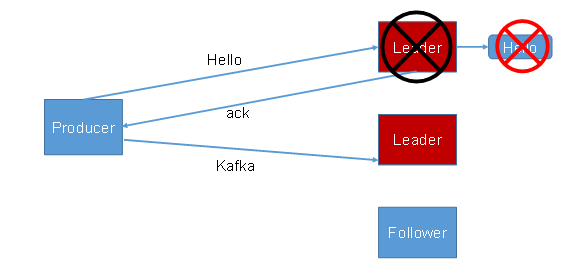
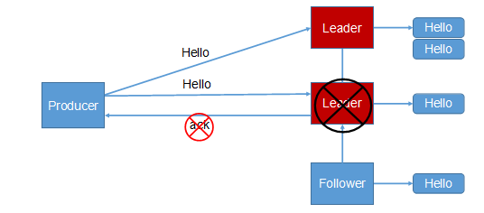
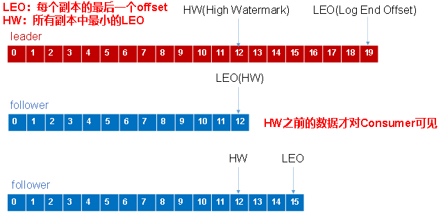

## Kafka 怎样防止数据丢失？

### 1. ack 机制

为保证 producer 发送的数据，能可靠的发送到指定的 topic，topic 的每个 partition 收到 producer 发送的数据后，都需要向 producer 发送 ack（acknowledgement确认收到），如果 producer 收到ack，就会进行下一轮的发送，否则重新发送数据。

**producer  往 leader 中发送数据，然后 follower 同步 leader 中的数据。问题是何时返回 ack，有两种策略，一种是半数以上完成同步，就发送 ack，还有一种是全部完成同步，才发送 ack。**

| 方案                         | 优点                                               | 缺点                                                        |
| ---------------------------- | -------------------------------------------------- | ----------------------------------------------------------- |
| 半数以上完成同步，就发送 ack | 延迟低                                             | 选举新的leader时，如果可以容忍n台节点的故障，需要2n+1个副本 |
| 全部完成同步，才发送 ack     | 选举新的leader时，容忍n台节点的故障，需要n+1个副本 | 延迟高                                                      |

Kafka 选择了第二种方案，原因如下：

1. 同样为了容忍 n 台节点的故障，第一种方案需要 2n+1 个副本，而第二种方案只需要 n+1 个副本，而 Kafka 的每个分区都有大量的数据，第一种方案会造成大量数据的冗余。

2. 虽然第二种方案的网络延迟会比较高，但网络延迟对 Kafka 的影响较小。

### 2. ISR(in-sync replica set)

采用第二种方案之后，设想以下情景：leader 收到数据，所有 follower 都开始同步数据，但有一个 follower，因为某种故障，迟迟不能与 leader 进行同步，那 leader 就要一直等下去，直到它完成同步，才能发送 ack。这个问题怎么解决呢？

Leader 维护了一个动态的 in-sync replica set (ISR)，意为和 leader 保持同步的 follower 集合。当 ISR 中的follower  完成数据的同步之后，leader 就会给 producer 发送 ack。如果 follower 长时间未向 leader 同步数据，则该 follower 将被踢出 ISR，该时间阈值由 **replica.lag.time.max.ms** 参数设定。如果 Leader 发生故障之后，就会从 ISR 中选举新的 leader。

### 3. ack 应答级别

对于某些不太重要的数据，对数据的可靠性要求不是很高，能够容忍数据的少量丢失，所以没必要等 ISR 中的follower 全部接收成功。所以 Kafka 为用户提供了三种可靠性级别，用户根据对可靠性和延迟的要求进行权衡，选择以下的级别。

- 0：这一操作提供了一个最低的延迟，partition 的 leader 接收到消息还没有写入磁盘就已经返回 ack，当 leader 故障时有可能**丢失数据**；

- 1： partition 的 leader 落盘成功后返回 ack，如果在 follower 同步成功之前 leader 发生故障，那么将会**丢失数据**；如图：producer 向 leader 发送 "hello" ，成功返回 ack，follower 同步成功之前 leader 故障，"hello" 数据就此丢失。

​		

- -1： partition 的 leader 和 follower 全部落盘成功后才返回 ack。但是如果在 follower 同步完成后，broker 发送 ack 之前，leader 发生故障，那么会造成**数据重复**。

### 4. leader 和 follower 故障处理细节（HW和LEO）

**LEO：指的是分区的每个副本可被消费的最大的offset，也就是当前写数据的位置；**

**HW：指的是消费者能见到的最大的offset，在ISR 队列中的副本中的 LEO的最小值。**

**（1）follower故障**

follower 发生故障后会被临时踢出 ISR，待该 follower 恢复后，follower 会读取本地磁盘记录的上次的 HW，并将 log 文件高于 HW 的部分截取掉，从 HW 开始向 leader 进行同步。等该 **follower 的 LEO 大于等于该Partition 的 HW**，即follower追上leader之后，就可以重新加入 ISR 了。

**（2）leader故障**

leader 发生故障之后，会从 ISR 中选出一个新的 leader，之后，为保证多个副本之间的数据一致性，其余的follower 会先将各自的 log 文件高于 HW 的部分截掉，然后从新的leader同步数据。

**注意：HW只能保证副本之间的数据一致性，并不能保证数据不丢失或者不重复。**