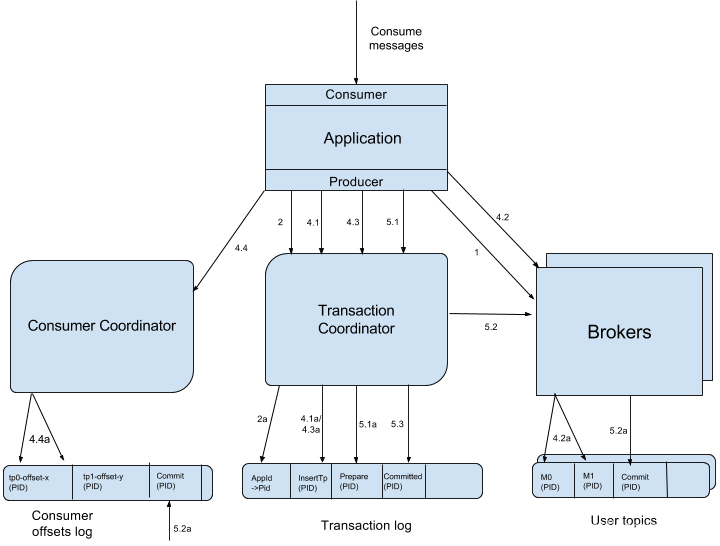

## Kafka 的幂等性和事务
Kafka 在 0.11 版本之前只能保证 At-Least-Once 或 At-Most-Once 语义，从 0.11 版本开始，引入了幂等发送和事务，从而开始保证 EXACTLY_ONCE 语义，下面来看看 Kafka 中幂等发送和事务的原理：

### 幂等性
在未引入幂等性时，Kafka 正常发送和重试发送消息流程图如下：

为了实现 Producer 的幂等语义，Kafka 引入了Producer ID（即PID）和 Sequence Number。每个新的Producer 在初始化的时候会被分配一个唯一的 PID，该 PID 对用户完全透明而不会暴露给用户。

同一个 producer 重启后，pid会变化。

Producer 发送每条消息 <Topic, Partition> 对于 Sequence Number 会从0开始单调递增，broker 端会为每个**<PID, Topic, Partition>** 维护一个序号（**也就是每一个生产者，每一个分区都有一个序号**），每次 commit 一条消息此序号加一，对于接收的每条消息，如果其序号比Broker维护的序号（即最后一次 Commit 的消息的序号）大1或者以上，则 Broker 会接受它，否则将其丢弃：

序号比 Broker 维护的序号大1以上，说明存在乱序。
序号比 Broker 维护的序号小，说明此消息以及被保存，为重复数据。
有了幂等性，Kafka 正常发送和重试发送消息流程图如下：

**幂等性机制仅解决了单分区上的数据重复和乱序问题，对于跨session和所有分区的重复和乱序问题不能得到解决。于是需要引入事务。**

### 事务

官网介绍：

[KIP-98 - Exactly Once Delivery and Transactional Messaging - Apache Kafka - Apache Software Foundation](https://cwiki.apache.org/confluence/display/KAFKA/KIP-98+-+Exactly+Once+Delivery+and+Transactional+Messaging#KIP98ExactlyOnceDeliveryandTransactionalMessaging-1.Findingatransactioncoordinator--theFindCoordinatorRequest)

事务是指所有的操作作为一个原子，要么都成功，要么都失败，而不会出现部分成功或部分失败的可能。举个例子，比如小明给小王转账1000元，那首先小明的账户会减去1000，然后小王的账户会增加1000，这两个操作就必须作为一个事务，否则就会出现只减不增或只增不减的问题，因此要么都失败，表示此次转账失败。要么都成功，表示此次转账成功。分布式下为了保证事务，一般采用两阶段提交协议。

**为了解决跨 session 和所有分区不能 EXACTLY-ONCE 问题，Kafka从 0.11 开始引入了事务。**

为了支持事务，Kafka 引入了 **Transacation Coordinator** 来协调整个事务的进行，并可将事务持久化到内部topic 里，类似于 offset 和 group 的保存。

用户为应用提供一个全局的 Transacation ID（是由用户在生产者给定的），应用重启后 Transacation ID 不会改变。为了保证新的 Producer 启动后，旧的具有相同 Transaction ID 的 Producer 即失效，每次 Producer 通过 Transaction ID 拿到 PID 的同时，还会获取一个单调递增的 epoch。由于旧的 Producer 的 epoch 比新 Producer 的 epoch 小，Kafka 可以很容易识别出该 Producer 是老的 Producer 并拒绝其请求。有了 Transaction ID 后，Kafka 可保证：

跨 Session 的数据幂等发送。当具有相同 Transaction ID 的新的 Producer 实例被创建且工作时，旧的 Producer停止工作。
跨 Session 的事务恢复。如果某个应用实例宕机，新的实例可以保证任何未完成的旧的事务要么 Commit 要么Abort，使得新实例从一个正常状态开始工作。
KPI-98 对 Kafka 事务原理进行了详细介绍，完整的流程图如下：

Producer 向任意一个 brokers 发送 FindCoordinatorRequest请求来获取 Transaction Coordinator 的地址

找到 Transaction Coordinator 后，具有幂等特性的 Producer 必须发起 InitPidRequest 请求以获取 PID。

2.1 当设置了 Transaction ID

如果开启了事务特性，设置了 Transaction ID，则 Transaction ID 会和 InitPidRequest 请求一起传递，并且在步骤 2a 中将 Transaction ID和对应的 PID 持久化到事务日志中，**这使我们能够将 Transaction ID 的相同 PID 返回给 producer 的未来实例，从而使恢复或中止先前未完成的事务成为可能**。除了返回 PID 外，InitPidRequest 还会执行如下任务：

增加该 PID 对应的 epoch。具有相同 PID 但 epoch 小于该 epoch 的其它 Producer（如果有）新开启的事务将被拒绝。
恢复（Commit 或 Abort ）之前的 Producer 未完成的事务（如果有）。
注意：InitPidRequest 的处理过程是同步阻塞的。一旦该调用正确返回，Producer 即可开始新的事务。

2.2 当没有设置 Transaction ID
如果事务特性未开启，InitPidRequest可发送至任意Broker，并且会得到一个全新的唯一的PID。该Producer将只能使用幂等特性以及单一Session内的事务特性，而不能使用跨Session的事务特性。

调用beginTransaction()方法开启一个事务，Producer本地会记录已经开启了事务，但Transaction Coordinator只有在Producer发送第一条消息后才认为事务已经开启。

Consume-Transform-Produce
这一阶段，包含了整个事务的数据处理过程，并且包含了多种请求。

**总结：Transaction ID保证了同一个 producer 获得相同的PID，保证了跨会话问题，即使producer 重启也是同一个PID。epoch 保证了 多分区问题。**

----

4.1 AddPartitionsToTxnRequest
一个Producer可能会给多个<Topic, Partition>发送数据，给一个新的<Topic, Partition>发送数据前，它需要先向Transaction Coordinator发送AddPartitionsToTxnRequest。Transaction Coordinator会将该<Transaction, Topic, Partition>存于Transaction Log内，并将其状态置为BEGIN，如上图中步骤4.1所示。有了该信息后，我们才可以在后续步骤中为每个Topic, Partition>设置COMMIT或者ABORT标记（如上图中步骤5.2所示）。另外，如果该<Topic, Partition>为该事务中第一个<Topic, Partition>，Transaction Coordinator还会启动对该事务的计时（每个事务都有自己的超时时间）。

4.2 ProduceRequest
Producer通过一个或多个ProduceRequest发送一系列消息。除了应用数据外，该请求还包含了PID，epoch，和Sequence Number。该过程如上图中步骤4.2所示。

4.3 AddOffsetCommitsToTxnRequest
为了提供事务性，Producer新增了sendOffsetsToTransaction方法，该方法将多组消息的发送和消费放入同一批处理内。

该方法先判断在当前事务中该方法是否已经被调用并传入了相同的Group ID。若是，直接跳到下一步；若不是，则向Transaction Coordinator发送AddOffsetsToTxnRequests请求，Transaction Coordinator将对应的所有<Topic, Partition>存于Transaction Log中，并将其状态记为BEGIN，如上图中步骤4.3所示。该方法会阻塞直到收到响应。TxnOffsetCommitRequest作为sendOffsetsToTransaction方法的一部分，在处理完AddOffsetsToTxnRequest后，Producer也会发送TxnOffsetCommit请求给Consumer Coordinator从而将本事务包含的与读操作相关的各<Topic, Partition>的Offset持久化到内部的__consumer_offsets中，如上图步骤4.3a

4.4 TxnOffsetCommitRequest
作为sendOffsetsToTransaction方法的一部分，在处理完AddOffsetsToTxnRequest后，Producer也会发送TxnOffsetCommit请求给Consumer Coordinator从而将本事务包含的与读操作相关的各<Topic, Partition>的Offset持久化到内部的__consumer_offsets中，如上图步骤4.4所示。在此过程中，Consumer Coordinator会通过PID和对应的epoch来验证是否应该允许该Producer的该请求。
这里需要注意：

写入__consumer_offsets的Offset信息在当前事务Commit前对外是不可见的。也即在当前事务被Commit前，可认为该Offset尚未Commit，也即对应的消息尚未被完成处理。
Consumer Coordinator并不会立即更新缓存中相应<Topic, Partition>的Offset，因为此时这些更新操作尚未被COMMIT或ABORT。
提交或回滚事务
一旦上述数据写入操作完成，应用程序必须调用KafkaProducer的commitTransaction方法或者abortTransaction方法以结束当前事务。

5.1 EndTxnRequest
commitTransaction方法使得Producer写入的数据对下游Consumer可见。abortTransaction方法通过Transaction Marker将Producer写入的数据标记为Aborted状态。下游的Consumer如果将isolation.level设置为READ_COMMITTED，则它读到被Abort的消息后直接将其丢弃而不会返回给客户程序，也即被Abort的消息对应用程序不可见。

无论是Commit还是Abort，Producer都会发送EndTxnRequest请求给Transaction Coordinator，并通过标志位标识是应该Commit还是Abort。

收到该请求后，Transaction Coordinator会进行如下操作

将PREPARE_COMMIT或PREPARE_ABORT消息写入Transaction Log，如上图中步骤5.1所示
通过WriteTxnMarker请求以Transaction Marker的形式将COMMIT或ABORT信息写入用户数据日志以及Offset Log中，如上图中步骤5.2所示
最后将COMMIT或ABORT信息写入Transaction Log中，如上图中步骤5.3所示。
上述第二步是实现将一组读操作与写操作作为一个事务处理的关键。因为Producer写入的数据Topic以及记录Comsumer Offset的Topic会被写入相同的Transactin Marker，所以这一组读操作与写操作要么全部COMMIT要么全部ABORT。

5.2 WriteTxnMarkerRequest
上面提到的WriteTxnMarkerRequest由Transaction Coordinator发送给当前事务涉及到的每个<Topic, Partition>的Leader。收到该请求后，对应的Leader会将对应的COMMIT(PID)或者ABORT(PID)控制信息写入日志，如上图中步骤5.2所示。

该控制消息向Broker以及Consumer表明对应PID的消息被Commit了还是被Abort了。

这里要注意，如果事务也涉及到consumer_offsets，即该事务中有消费数据的操作且将该消费的Offset存于consumer_offsets中，Transaction Coordinator也需要向该内部Topic的各Partition的Leader发送WriteTxnMarkerRequest从而写入COMMIT(PID)或COMMIT(PID)控制信息。

5.2 写入最终的COMMIT或ABORT消息
写完所有的Transaction Marker后，Transaction Coordinator会将最终的COMMIT或ABORT消息写入Transaction Log中以标明该事务结束，如上图中步骤5.3所示。

此时，Transaction Log中大多数关于该事务的消息全部可以移除。当然，由于Kafka内数据是Append Only的，不可直接更新和删除，这里说的移除只是将其标记为null从而在Log Compact时不再保留。

我们只需要保留已完成事务的PID和时间戳，因此最终可以为生产者删除TransactionalId-> PID映射。